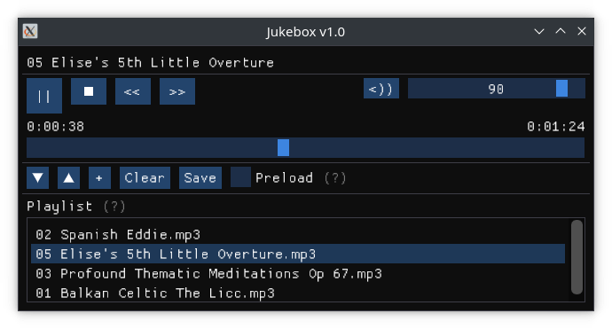

# Jukebox

### Nano music player

#### Using C++20, capo, Vulkan, and Dear ImGui

#### Features

- Multi-track MP3 / FLAC / WAV playback
- Export / import playlist (as plaintext file)
- Preload tracks for instant seeking

#### Dependencies

- [capo](https://github.com/capo-devs/capo)
- [Dear ImGui](https://github.com/ocornut/imgui)
- [vk-bootstrap](https://github.com/charles-lunarg/vk-bootstrap)
- [VulkanHPP](https://github.com/KhronosGroup/Vulkan-Hpp)
- [glfw](https://github.com/glfw/glfw)

[Original repository](https://github.com/capo-devs/jukebox)

[LICENCE](LICENSE)
